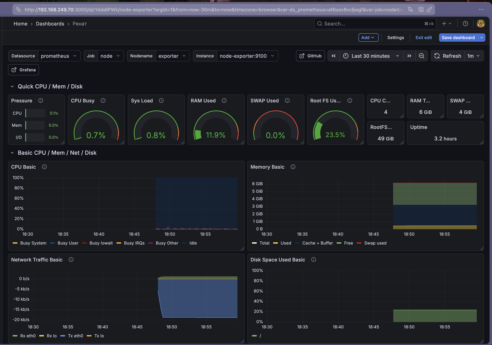

# Домашнее задание: Мониторинг с Prometheus и Grafana

## Описание задачи

Настроить систему мониторинга с использованием Prometheus и Grafana, включающую дашборд с 4 графиками:
- Память (RAM)
- Процессор (CPU)
- Диск (Disk)
- Сеть (Network)

## Архитектура решения

Система мониторинга состоит из следующих компонентов:

1. **Prometheus** — система сбора и хранения метрик
2. **Node Exporter** — экспортер системных метрик хоста
3. **Grafana** — платформа для визуализации метрик


## Структура проекта

```
OTUS/
├── monitoring/
│   ├── docker-compose.yml          # Конфигурация всех сервисов
│   ├── configuration/
│   │   └── prometheus.yml          # Конфигурация Prometheus
│   ├── data/                       # Данные Prometheus
│   └── grafana/                    # Данные Grafana
└── README.md
```

## Установка и настройка

### Предварительные требования

- Docker и Docker Compose установлены на хосте
- Доступ к портам: 9090 (Prometheus), 9100 (Node Exporter), 3000 (Grafana)

### Шаг 1: Создание структуры директорий

```bash
mkdir -p monitoring/configuration
mkdir -p monitoring/data
mkdir -p monitoring/grafana

cd monitoring
```

### Шаг 2: Создание docker-compose.yml

Создан файл `monitoring/docker-compose.yml` со следующими сервисами:

- **prometheus**: сервер сбора метрик
- **node-exporter**: экспортер системных метрик
- **grafana**: веб-интерфейс для визуализации

### Шаг 3: Создание конфигурации Prometheus

Создан файл `monitoring/configuration/prometheus.yml` с настройкой сбора метрик от Node Exporter.

### Шаг 4: Настройка прав доступа

```bash
chown -R 65534:65534 monitoring/data
```

### Шаг 5: Запуск сервисов

```bash
cd monitoring
docker-compose up -d
```

### Шаг 6: Проверка работы сервисов

После запуска доступны следующие интерфейсы:

- **Prometheus**: http://192.168.249.70:9090
- **Node Exporter**: http://192.168.249.70:9100/metrics
- **Grafana**: http://192.168.249.70:3000
  - Логин по умолчанию: `admin`
  - Пароль по умолчанию: `admin`

## Настройка Grafana

### Импорт дашборда Node Exporter

1. Перейти в **Dashboards** → **Import**
2. Ввести ID дашборда: **1860** (Node Exporter)
3. Выбрать источник данных **Prometheus**
4. Нажмите **Import**



## Конфигурационные файлы

### docker-compose.yml

Основные параметры конфигурации:

- **Prometheus**: порт 9090, том с конфигурацией и данными
- **Node Exporter**: порт 9100, монтирование `/proc`, `/sys`, `/` для сбора метрик
- **Grafana**: порт 3000, том для хранения дашбордов и настроек
- Все сервисы в одной Docker сети для взаимодействия

### prometheus.yml

Конфигурация включает:

- **scrape_interval**: 5 секунд (частота сбора метрик)
- **job_name**: node (название задачи сбора)
- **targets**: node-exporter:9100 (адрес Node Exporter в Docker сети)
