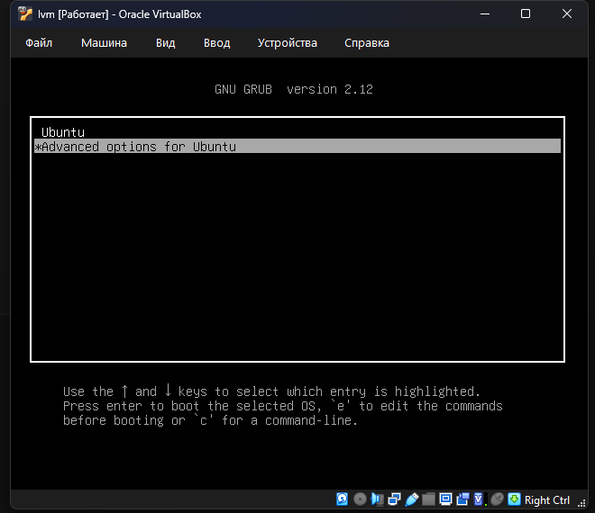
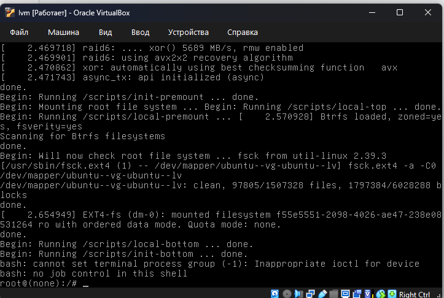
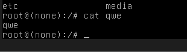
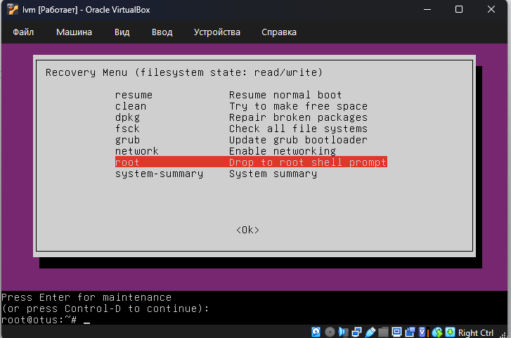
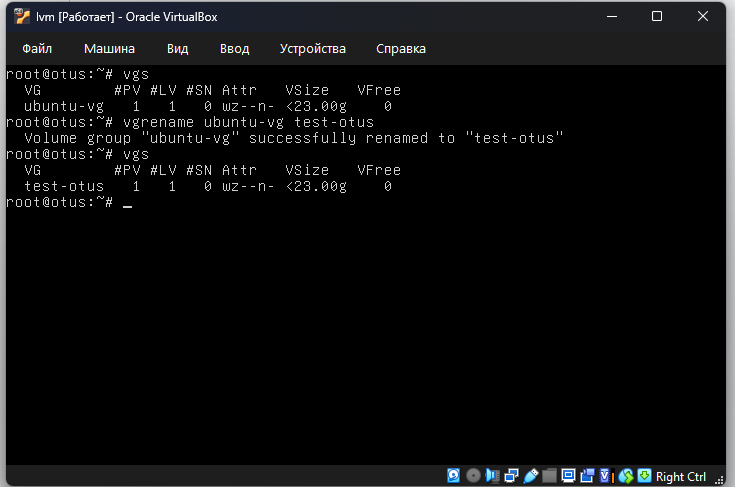

# Домашнее задание: Работа с загрузчиком

## Описание задач

В данной лабораторной работе были поставлены следующие задачи:

1. Включить отображение меню Grub.
2. Попасть в систему без пароля несколькими способами.
3. Установить систему с LVM, после чего переименовать VG.

---


## Решение

### 1. Включение отображение меню Grub.

1. Меняем параметры граба в настройках /etc/default/grub

```bash
# If you change this file, run 'update-grub' afterwards to update                                         
# /boot/grub/grub.cfg.
# For full documentation of the options in this file, see:
#   info -f grub -n 'Simple configuration'

GRUB_DEFAULT=0
#GRUB_TIMEOUT_STYLE=hidden
GRUB_TIMEOUT=10
GRUB_DISTRIBUTOR=`( . /etc/os-release; echo ${NAME:-Ubuntu} ) 2>/dev/null || echo Ubuntu`
GRUB_CMDLINE_LINUX_DEFAULT=""
GRUB_CMDLINE_LINUX=""
```

2. Применяем изменения
```bash
update-grub
```


3. Перезагружаем и попадаем в меню GRUB:




### 2. Попадаем в систему без пароля несколькими способами.


1. Способ через init=/bin/bash

Дописав в режиме запуска init=/bin/bash мы попадаем в ОС без пароля но в RO режиме



Перемонтируя ФС через 

```bash 
mount -o remount,rw /
```

Мы можем взаимодействовать с файлами в write режиме (создал файл, показал его)




2. Recovery mode

В этом меню сначала включаем поддержку сети для того, чтобы файловая система перемонтировалась в режим read/write.
Далее выбираем пункт root и попадаем в консоль с пользователем root.





### 3. Переименование VG

